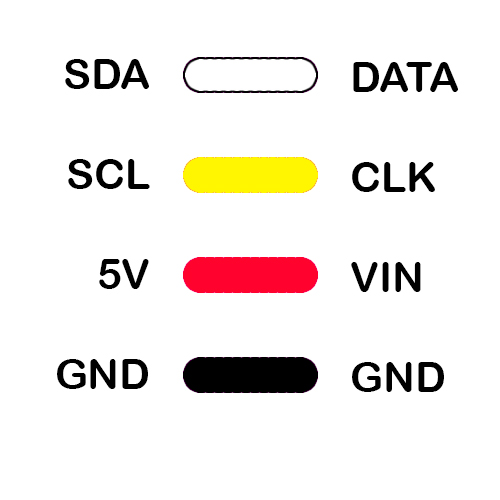

# OLED Displays

#### Here are files supporting using OLED displays with Arduino.
OLED uses the adafruit GFX library for doing drawing commands. [GFX Library Documentation](https://cdn-learn.adafruit.com/downloads/pdf/adafruit-gfx-graphics-library.pdf)

Web link to convert images to show on screens [Make BITMAP IMAGES](https://javl.github.io/image2cpp/)

Get animated icons and emojis to show on OLED [WOKWI animator](https://animator.wokwi.com/)

List of u8g2 fonts [U8G2 fonts](https://github.com/olikraus/u8g2/wiki/fntlist8)


#### Wiring Labelling for OLED



#### Draw Image to Screen
```java
  display.clearDisplay();
  display.drawBitmap(0, 0,  eye2, 128, 64, WHITE);
  display.display();
```


